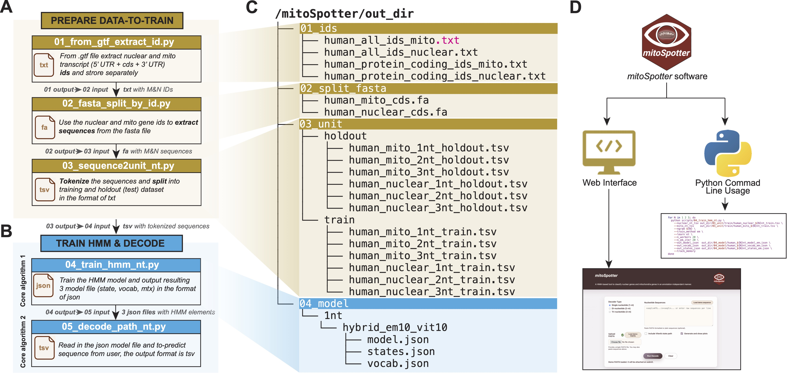
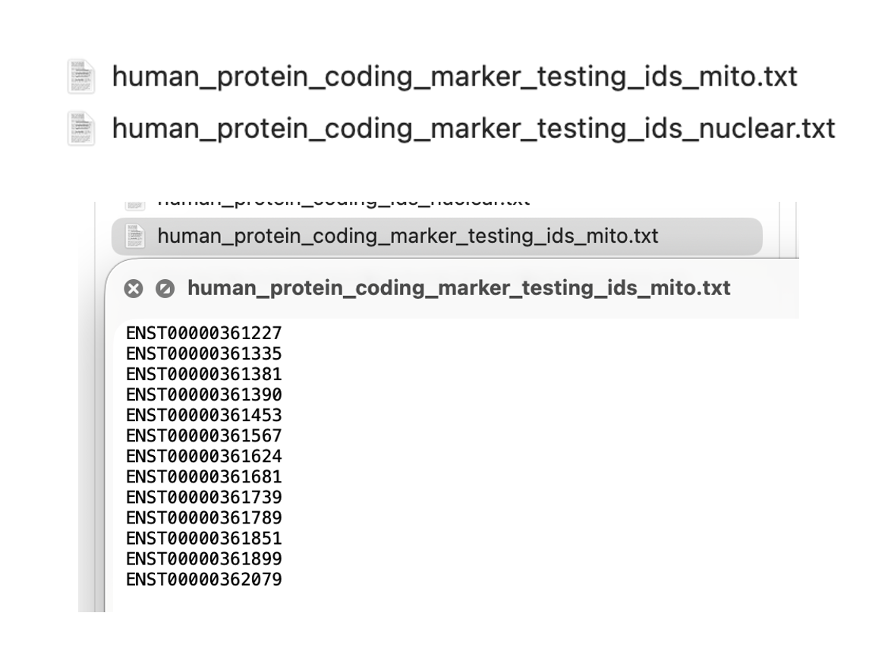
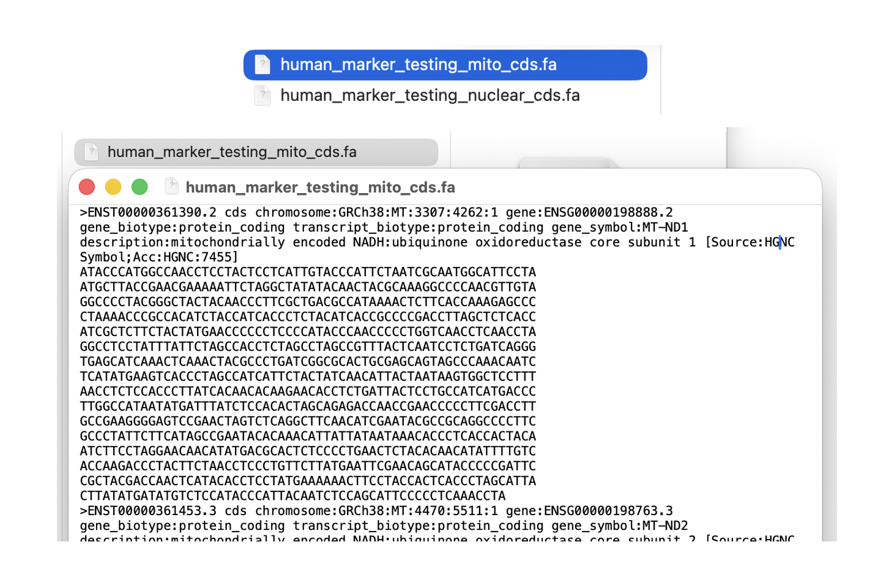
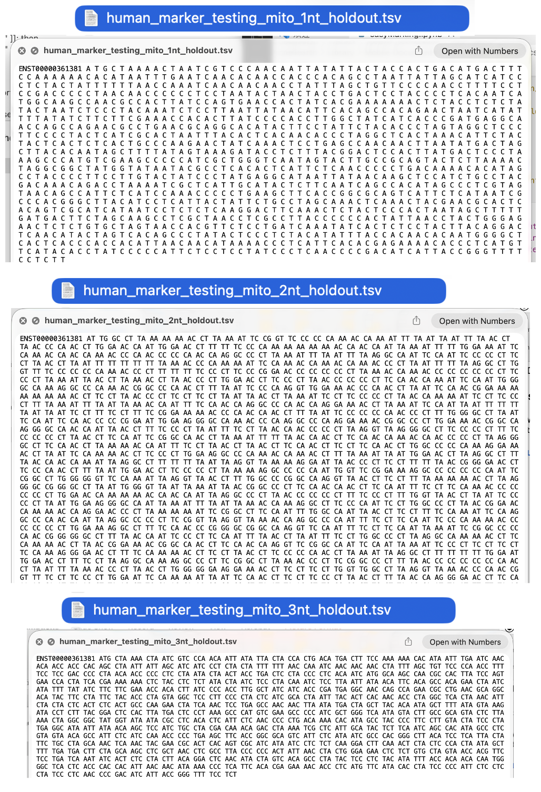
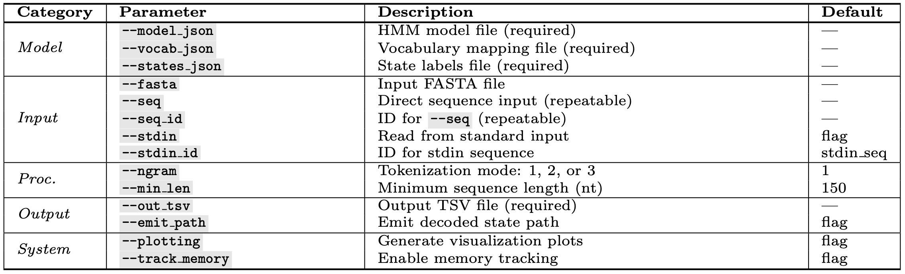
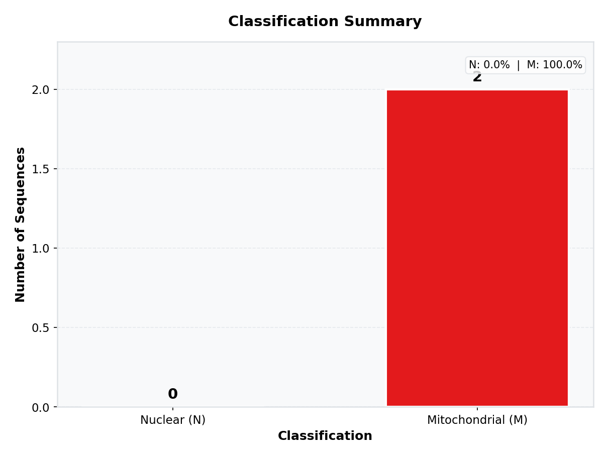
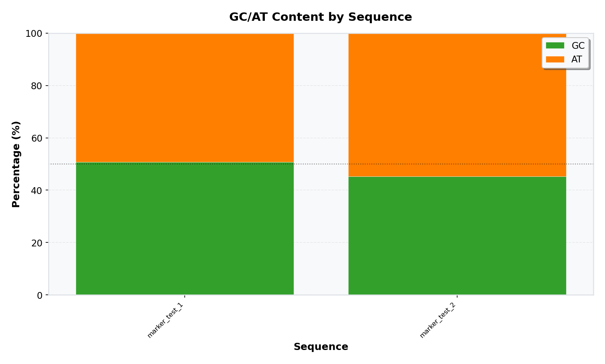
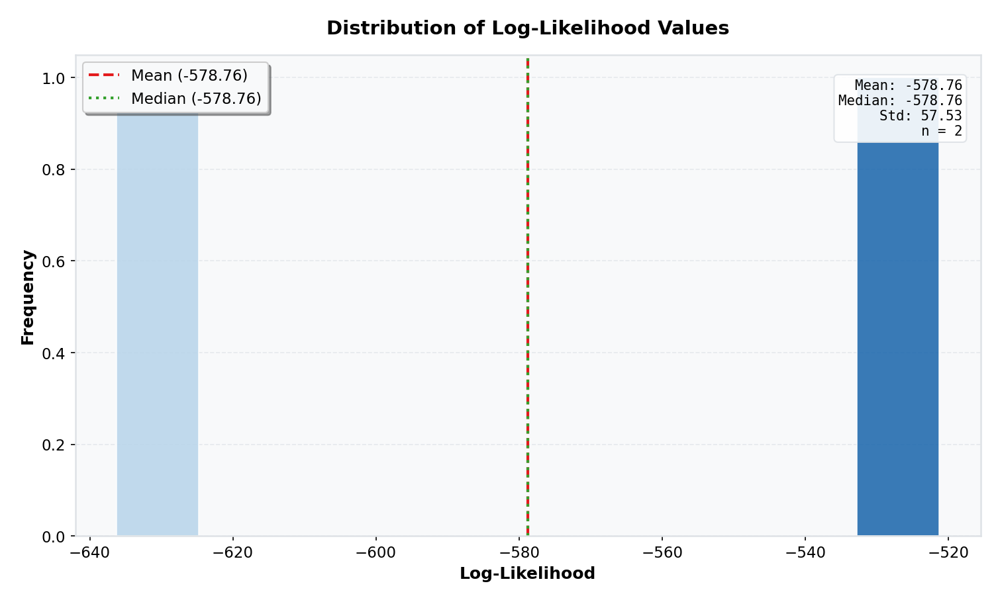
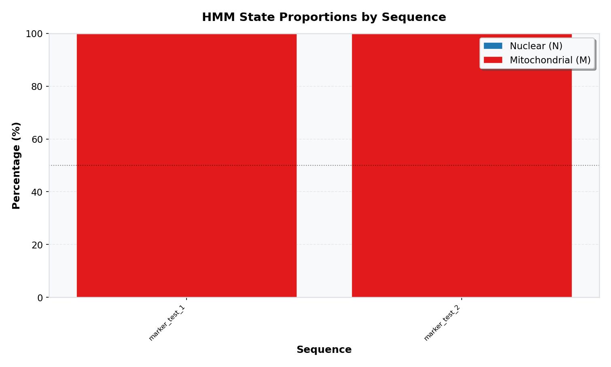
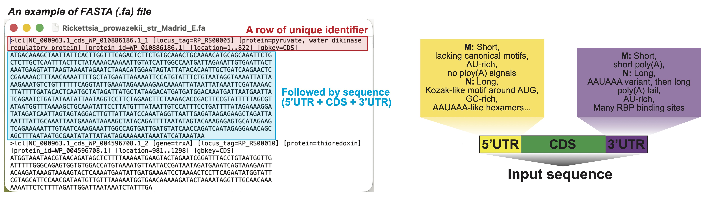

# An easy *mitoSpotter* running pipeline for markers 

Welcome to the *mitoSpotter* marker analysis pipeline! This notebook provides a step-by-step guide to identifying mitochondrial and nuclear gene markers using Hidden Markov Models (HMMs). Whether you are new to bioinformatics or an experienced researcher, this pipeline is designed to be accessible, reproducible, and efficient.

All the data, scripts, and output from scripts are already in-place in our well-structured directory. Detailed file connection illustration is as follows.

**NOTE:** This `README.md` provides the exact same workflow and instrcution as the one in `easyMarking.ipynb`. So if you wanna replace the code or some arguments and run directly, we highly recommand you to follow the jupyter notebook version.



All the preprocessed dataset (e.g., output from 01-03 scripts have been deposited in out_dir directory, but if you want to run this part, you can still do it!).

## At a glimpse: Overall script structure

Below is the directory structure of the `scripts/` folder, which contains all Python scripts used in this pipeline. The flow is sequential and each script performs a specific task. The output of one script serves as the input for the next.

/mitoSpotter/scripts  
├── 01_from_gtf_extract_id.py  
├── 02_fasta_split_by_id.py  
├── 03_sequence2unit_nt.py  
├── 04_train_hmm_nt.py  
└── 05_decode_path_nt.py  

## Before we start


### Prerequisites

Before executing any cells in this notebook, please ensure the following:

1. **Environment Setup**:  
   You should have configured the conda or virtual environment as described in the main documentation. Also, ensure that the correct kernel is selected in your Jupyter environment.

2. **Download Required Data**:  
   The pipeline depends on two essential genomic files:
   - **CDS genome file**: [Homo_sapiens.GRCh38.cds.all.fa.gz](https://42basepairs.com/browse/web/ensembl/release-82/fasta/homo_sapiens/cds?file=Homo_sapiens.GRCh38.cds.all.fa.gz&preview=)
   - **GTF annotation file**: [Homo_sapiens.GRCh38.115.chr.gtf.gz](https://ftp.ensembl.org/pub/release-115/gtf/homo_sapiens/Homo_sapiens.GRCh38.115.chr.gtf.gz)  
   Download and place them in the `/mitoSpotter/data` directory. *Note: This download may take several minutes depending on your connection speed.*

3. **Import Necessary Packages**:  
   Run the cell below to import the required Python libraries. Importing is expected to take around 30s.

## STEP 1: EXTRACT NUCLEAR AND MITOCHONDRIA GENE ID

**Input**: GTF file  
**Output**: Two text files containing mitochondrial and nuclear gene IDs.  
**Key parameter**: `--protein_coding_only` ensures we only retain protein-coding genes, which are relevant for marker identification.

This step is expected to no more than 30s.

```bash
python scripts/01_from_gtf_extract_id.py \
  --gtf data/Homo_sapiens.GRCh38.115.chr.gtf \
  --outdir out_dir/01_ids \
  --prefix human_protein_coding_marker_testing_ \
  --protein_coding_only
```

### Expected Output



## 02 SPLIT FASTA BY ID

In this step, we want to get the sequence with these ids.

**Input**: A complete *5'UTR + CDS + 3' UTR* genome sequence file (FASTA format, from the previous step)

**Output**: Two FASTA files containing mitochondrial and nuclear gene sequences

**Key parameters**:

- `--mito_ids`: Path to file containing mitochondrial gene IDs

- `--nuc_ids`: Path to file containing nuclear gene IDs

- `--prefix`: Custom prefix for output filenames

This step is expected to take around 30s.

```bash
python scripts/02_fasta_split_by_id.py \
  --fasta data/Homo_sapiens.GRCh38.cds.all.fa \
  --mito_ids out_dir/01_ids/human_protein_coding_marker_testing_ids_mito.txt \
  --nuc_ids out_dir/01_ids/human_protein_coding_marker_testing_ids_nuclear.txt \
  --outdir out_dir/02_split_fasta \
  --prefix human_marker_testing_
```

### Expected Output



## 03 SEQUENCE TO NUCLEOTIDE UNIT

**Input**: Two FASTA files (mitochondrial and nuclear sequences)

**Output**: Train and test TSV files for each gene type

**Key parameters**: `--ngram 3` creates 3-nucleotide (codon) units, which are biologically meaningful for protein-coding genes. If you have nucleotide sequence that has intron and hasn't been translated, consider adding `--skip_phase_check` flag.

**Purpose**: This step will perform the sequence unit cutting and train/test split for subsequent model training. This step is expected to take no more than **1 minute**.

```bash
python scripts/03_sequence2unit_nt.py \
  --mito_fasta out_dir/02_split_fasta/human_marker_testing_mito.fasta \
  --nuclear_fasta out_dir/02_split_fasta/human_marker_testing_nuclear.fasta \
  --ngram 3 \
  --test_prop 0.2 \
  --outdir out_dir/03_unit \
  --prefix human_marker_testing_ \
  --seed 9999
```

### Expected Output



## 04 TRAIN HMM NT

**Input**: Train TSV files from Step 3 (3-nt units)

**Output**: Model JSON files (model, vocabulary, states)

**Training method**: `--train_method` can be one of the following:

- `em`: Expectation-Maximization (unsupervised)
- `viterbi`: Viterbi training (semi-supervised)
- `hybrid`: Combination of EM and Viterbi, where `--n_em_iter` and `--n_viterbi_iter` control the number of iterations for each method.

**Key parameters**:

- `--ngram 3`: Match the unit size from Step 3
- `--learn et`: Optimize both Emission and Transition probabilities (super important!)
- `--sample`: Downsample rate for faster training (0.01 = 1% of data)
- `--n_workers`: Number of parallel workers (for Mac/Linux; remove for Windows)

**Purpose**: This step trains a two-state HMM that distinguishes between nuclear and mitochondrial sequence patterns.

### EM

Expected to take no longer than 5 minutes with downsampling.

```bash
python scripts/04_train_hmm_nt.py \
  --nuclear_nt_tsv out_dir/03_unit/train/human_marker_testing_nuclear_3nt_train.tsv \
  --mito_nt_tsv out_dir/03_unit/train/human_marker_testing_mito_3nt_train.tsv \
  --ngram 3 \
  --train_method em \
  --n_em_iter 20 \
  --learn et \
  --out_model_json out_dir/04_model/human_marker_testing_3nt_model_em.json \
  --out_vocab_json out_dir/04_model/human_marker_testing_3nt_vocab_em.json \
  --out_states_json out_dir/04_model/human_marker_testing_3nt_states_em.json \
  --sample 0.0001 \
  --track_memory \
  --n_workers 2
```

### Viterbi

```bash
python scripts/04_train_hmm_nt.py \
  --nuclear_nt_tsv out_dir/03_unit/train/human_marker_testing_nuclear_3nt_train.tsv \
  --mito_nt_tsv out_dir/03_unit/train/human_marker_testing_mito_3nt_train.tsv \
  --ngram 3 \
  --train_method viterbi \
  --n_viterbi_iter 20 \
  --learn et \
  --out_model_json out_dir/04_model/human_marker_testing_3nt_model_viterbi.json \
  --out_vocab_json out_dir/04_model/human_marker_testing_3nt_vocab_viterbi.json \
  --out_states_json out_dir/04_model/human_marker_testing_3nt_states_viterbi.json \
  --sample 0.0001 \
  --track_memory \
  --n_workers 2
```

### Hybrid

```bash
# Let's make em 0.5 and viterbi 0.5 (1:1)
python scripts/04_train_hmm_nt.py \
  --nuclear_nt_tsv out_dir/03_unit/train/human_marker_testing_nuclear_3nt_train.tsv \
  --mito_nt_tsv out_dir/03_unit/train/human_marker_testing_mito_3nt_train.tsv \
  --ngram 3 \
  --train_method hybrid \
  --n_em_iter 10 \
  --n_viterbi_iter 10 \
  --learn et \
  --out_model_json out_dir/04_model/human_marker_testing_3nt_model_hybird.json \
  --out_vocab_json out_dir/04_model/human_marker_testing_3nt_vocab_hybird.json \
  --out_states_json out_dir/04_model/human_marker_testing_3nt_states_hybird.json \
  --sample 0.0001 \
  --track_memory \
  --n_workers 2
```

## 05 SEQUENCE DECODING



### FASTA

The FASTA file we provided contains a single CDS. This will take about 3s.

```bash
python scripts/05_decode_path_nt.py \
  --model_json out_dir/04_model/human_marker_testing_3nt_model_em.json \
  --vocab_json out_dir/04_model/human_marker_testing_3nt_vocab_em.json \
  --states_json out_dir/04_model/human_marker_testing_3nt_states_em.json \
  --ngram 3 \
  --fasta ./webui/static/Sample.fa \
  --min_len 10 \
  --out_tsv out_dir/05_res/human_marker_testing_fasta_res.tsv \
  --plotting \
  --track_memory
```

### ARGUMENT SEQUENCE PASSING

This is expected to take less than 3s.

```bash
python scripts/05_decode_path_nt.py \
  --model_json out_dir/04_model/human_marker_testing_3nt_model_em.json \
  --vocab_json out_dir/04_model/human_marker_testing_3nt_vocab_em.json \
  --states_json out_dir/04_model/human_marker_testing_3nt_states_em.json \
  --ngram 3 \
  --min_len 10 \
  --seq ATACCCATGGCCAACCTCCTACTCCTCATTGTACCCATTCTAATCGCAATGGCATTCCTAATGCTTACCGAACGAAAAATTCTAGGCTATATACAACTACGCAAAGGCCCCAACGTTGTAGGCCCCTACGGGCTACTACAACCCTTCGCTGACGCCATAAAACTCTTCACCAAAGAGCCCCTAAAACCCGCCACATCTACCATCACCCTCTACATCACCGCCCCGACCTTAGCTCTCACCATCGCTCTTCTACTATGAACCCCCCTCCCCATACCCAACCCCCTGGTCAACCTCAACCTAGGCCTCCTATTTATTCTAGCCACCTCTAGCCTAGCCGTTTACTCAATCCTCTGATCAGGGTGAGCATCAAACTCAAACTACGCCCTGATCGGCGCACTGCGAGCAGTAGCCCAAACAATCTCATATGAAGTCA \
  --seq_id marker_test_1 \
  --seq GTCACCCTAGCCATCATTCTACTATCAACATTACTAATAAGTGGCTCCTTTAACCTCTCCACCCTTATCACAACACAAGAACACCTCTGATTACTCCTGCCATCATGACCCTTGGCCATAATATGATTTATCTCCACACTAGCAGAGACCAACCGAACCCCCTTCGACCTTGCCGAAGGGGAGTCCGAACTAGTCTCAGGCTTCAACATCGAATACGCCGCAGGCCCCTTCGCCCTATTCTTCATAGCCGAATACACAAACATTATTATAATAAACACCCTCACCACTACAATCTTCCTAGGAACAACATATGACGCACTCTCCCCTGAACTCTACACAACATATTTTGTCACCAAGACCCTACTTCTAACCTCCCTGTTCTTATGAATTCGAACAGCATACCCCCGATTCCGCTACGACCAACTCATACACCTCCTATGAAAAAACTTCCTACCACTCACCCTAGCATTACTTATATGATATGTCTCCATACCCATTACAATCTCCAGCATTCCCCCTCAAACC \
  --seq_id marker_test_2 \
  --out_tsv out_dir/05_res/human_marker_testing_arg_res.tsv \
  --plotting \
  --track_memory
```

## Visualization of Results

The decoding step also generates several informative plots (if you pass `--plotting`) to help you interpret prediction results from the model and the compositional features of your sequences. The plots will be saved in the same directory where you run the script.

These are some examples of some plots will be generated if you input multiple sequences:

- **Classification Counts**: Shows the proportion of sequences classified as nuclear vs. mitochondrial.  
  

- **GC Content per Sequence**: Shows the GC content proportion across sequences, which often differs between nuclear and mitochondrial genes.
  

- **Log-Likelihood Distribution**: Displays the log-likelihood scores for all decoded sequences; higher values indicate better model fit.
  

- **Hidden State Proportions**: Illustrates the proportion of "time" each sequence spends in the "nuclear" or "mitochondrial" hidden state.
  
  
## If I want to test the model with my own genome, what should I do?

For training, we used the entire transcript sequence (5' UTR + CDS + 3' UTR) for a gene as input data, rather than just CDS alone, because UTR sequences exhibit substantial differences between mtGenes and nGenes. For example, mtGene 3'UTR often lacks the microRNA binding sites and typical polyA signals which are common in nGenes (see below for more detailed differences).

So if you want to test our training-decoding workflow with *YOUR* data, 5' UTR + CDS + 3' UTR sequence is preferred.

Enjoy using our software.

