<div align="center">


# _mitoSpotter_

[](https://www.python.org/)
[](https://flask.palletsprojects.com/)
[](https://numpy.org/)
[](https://biopython.org/)
[](https://matplotlib.org/)
[](https://pandas.pydata.org/)

[](LICENSE)

**A Hidden Markov Model (HMM) based tool to classify nuclear genes and mitochondria genes in an annotation-independent manner.**

</div>

---

## Table of Contents

- [Benchmark Results](#benchmark-results)
- [Pipeline Overview](#pipeline-overview)
- [Quick Start](#quick-start)
- [Directory Structure](#directory-structure)
- [Step-by-Step Pipeline](#step-by-step-pipeline)
- [Visualization Examples](#visualization-examples)
- [Using Your Own Data](#using-your-own-data)
- [Web Interface](#web-interface)

---

## Benchmark Results

Our model has been rigorously tested on both same-species and cross-species datasets. The results demonstrate strong classification accuracy across different experimental setups.

### Same Species Benchmark

Evaluation on human gene sequences with train/test split:

<div align="center">
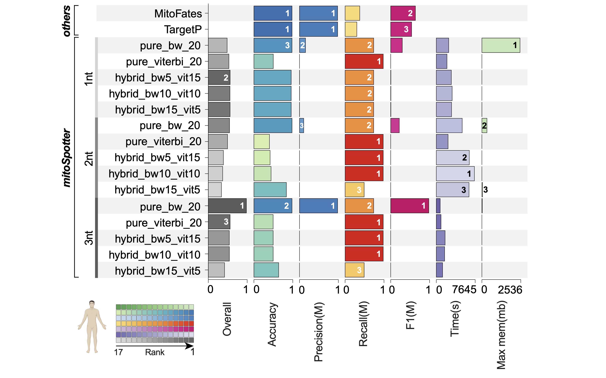
</div>

### Cross Species Benchmark

Generalization test across human, mouse, and rat genomes:

<div align="center">
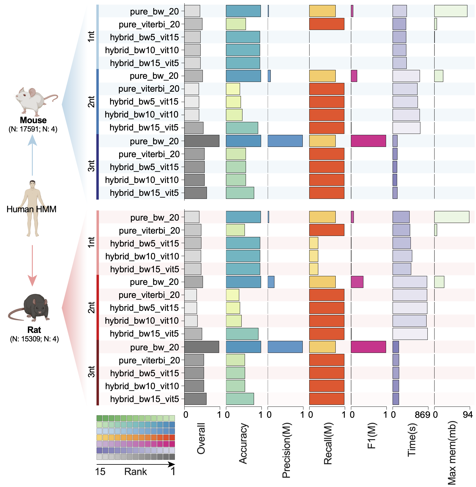
</div>

> **Key Finding:** The 3-nt (trinucleotide) EM model consistently achieves the highest accuracy and demonstrates the strongest cross-species generalizability.

---

## Pipeline Overview

### Training Workflow

The training pipeline processes genomic data through a series of steps to build the HMM classifier:

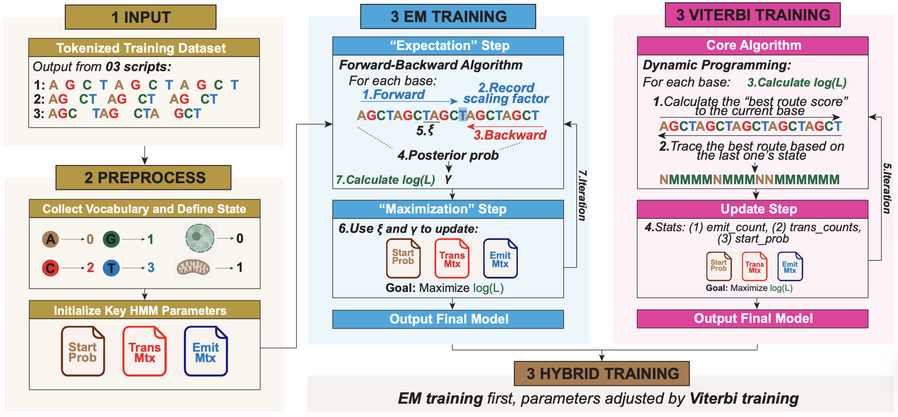

### Decoding Workflow

Once trained, the model can classify new sequences using Viterbi decoding:

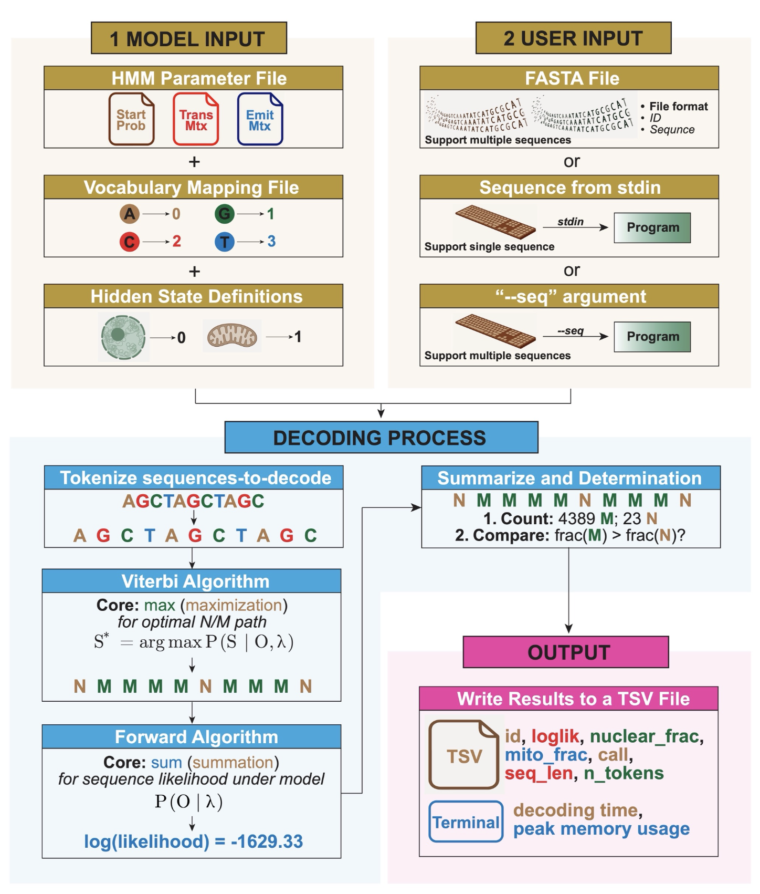

---

## Quick Start

```bash
# Clone the repository
git clone https://github.com/EthanShenx/mitoSpotter.git
cd mitoSpotter

# Create conda environment
conda env create -f env/environment-mac.yml  # or environment-windows.yml
conda activate mitoSpotter

# Run the web UI
python -m webui.app
# Visit http://localhost:8000
```

---

## Directory Structure

All the data, scripts, and output from scripts are already in-place in our well-structured directory:

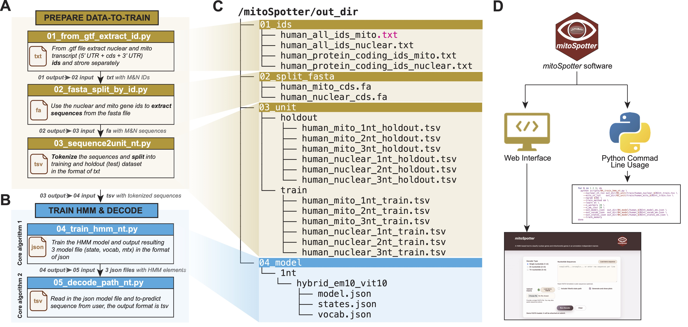

```
/mitoSpotter
├── scripts/                    # Core pipeline scripts
│   ├── 01_from_gtf_extract_id.py
│   ├── 02_fasta_split_by_id.py
│   ├── 03_sequence2unit_nt.py
│   ├── 04_train_hmm_nt.py
│   └── 05_decode_path_nt.py
├── webui/                      # Flask web application
├── data/                       # Input genomic data
├── out_dir/                    # Pipeline outputs
└── env/                        # Conda environments
```

**NOTE:** This `README.md` provides the exact same workflow and instruction as the one in `easyMarking.ipynb`. If you want to replace the code or some arguments and run directly, we highly recommend you to follow the Jupyter notebook version.

---

## Step-by-Step Pipeline

### Prerequisites

Before executing any commands, please ensure:

1. **Environment Setup**: Configure the conda environment as described above.

2. **Download Required Data** (if not in `/mitoSpotter/data`):
   - **CDS genome file**: [Homo_sapiens.GRCh38.cds.all.fa.gz](https://42basepairs.com/browse/web/ensembl/release-82/fasta/homo_sapiens/cds?file=Homo_sapiens.GRCh38.cds.all.fa.gz&preview=)
   - **GTF annotation file**: [Homo_sapiens.GRCh38.115.chr.gtf.gz](https://ftp.ensembl.org/pub/release-115/gtf/homo_sapiens/Homo_sapiens.GRCh38.115.chr.gtf.gz)

---

### Step 1: Extract Gene IDs

**Input**: GTF file
**Output**: Two text files containing mitochondrial and nuclear gene IDs
**Runtime**: ~15 seconds

```bash
python scripts/01_from_gtf_extract_id.py \
  --gtf data/Homo_sapiens.GRCh38.115.chr.gtf \
  --outdir out_dir/01_ids \
  --prefix human_protein_coding_marker_testing_ \
  --protein_coding_only
```

**Expected Output:**

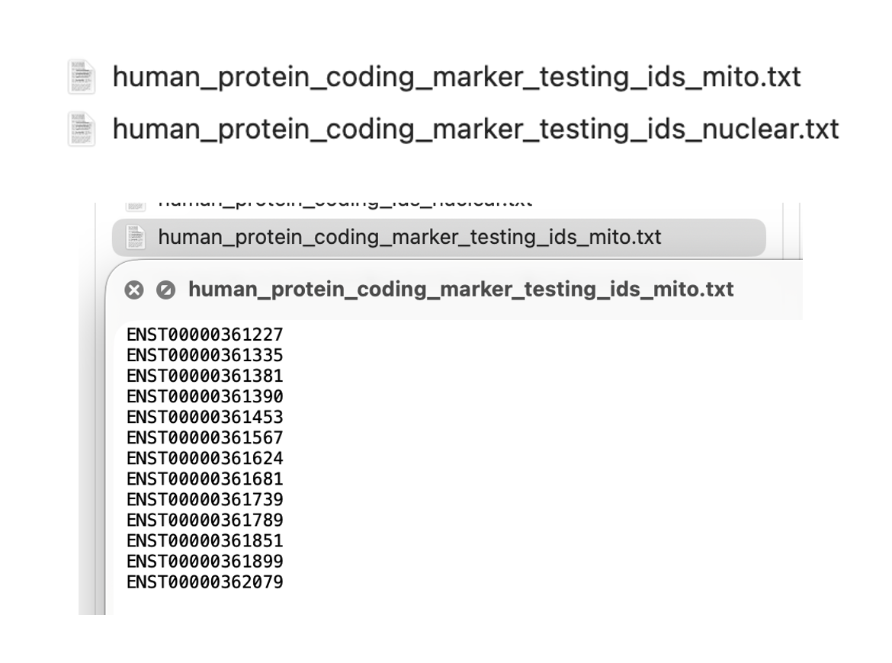

---

### Step 2: Split FASTA by ID

**Input**: Complete *5'UTR + CDS + 3'UTR* genome sequence file (FASTA format)
**Output**: Two FASTA files containing mitochondrial and nuclear gene sequences
**Runtime**: ~30 seconds

```bash
python scripts/02_fasta_split_by_id.py \
  --fasta data/Homo_sapiens.GRCh38.cds.all.fa \
  --mito_ids out_dir/01_ids/human_protein_coding_marker_testing_ids_mito.txt \
  --nuc_ids out_dir/01_ids/human_protein_coding_marker_testing_ids_nuclear.txt \
  --outdir out_dir/02_split_fasta \
  --prefix human_marker_testing_
```

**Expected Output:**

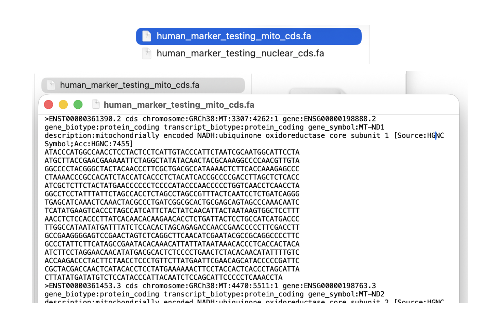

---

### Step 3: Sequence to Nucleotide Units

**Input**: Two FASTA files (mitochondrial and nuclear sequences)
**Output**: Train and test TSV files for each gene type
**Runtime**: ~1 minute

**Key parameters**:
- `--ngram 3` creates 3-nucleotide (codon) units, biologically meaningful for protein-coding genes
- Add `--skip_phase_check` if your sequences contain introns

```bash
for loc in nuclear mito; do
  for kind in cds; do
    for mode in 3nt 2nt 1nt; do
      echo "Running: $loc $kind $mode"
      python scripts/03_sequence2unit_nt.py \
        --fasta out_dir/02_split_fasta/human_marker_testing_${loc}_${kind}.fa \
        --mode $mode \
        --train_tsv out_dir/03_unit/train/human_marker_testing_${loc}_${mode}_train.tsv \
        --holdout_tsv out_dir/03_unit/holdout/human_marker_testing_${loc}_${mode}_holdout.tsv \
        --train_frac 0.7
    done
  done
done
```

**Expected Output:**

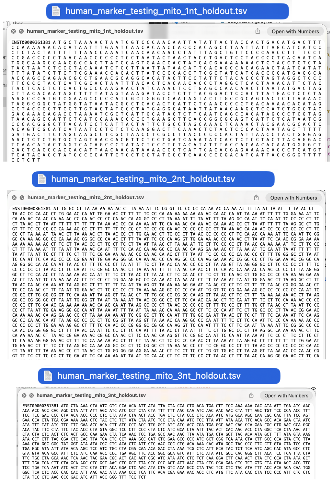

---

### Step 4: Train HMM

**Input**: Train TSV files from Step 3
**Output**: Model JSON files (model, vocabulary, states)
**Runtime**: ~5 minutes with downsampling

**Training methods:**
| Method | Description |
|--------|-------------|
| `em` | Expectation-Maximization (Baum-Welch) |
| `viterbi` | Viterbi training (hard EM) |
| `hybrid` | EM followed by Viterbi fine-tuning |

**Key parameters:**
- `--ngram 3`: Match the unit size from Step 3
- `--learn et`: Optimize both Emission and Transition probabilities *(important!)*
- `--sample`: Downsample rate for faster training
- `--n_workers`: Number of parallel workers (Mac/Linux only)

#### EM Training

```bash
python scripts/04_train_hmm_nt.py \
  --nuclear_nt_tsv out_dir/03_unit/train/human_marker_testing_nuclear_3nt_train.tsv \
  --mito_nt_tsv out_dir/03_unit/train/human_marker_testing_mito_3nt_train.tsv \
  --ngram 3 \
  --train_method em \
  --n_em_iter 20 \
  --learn et \
  --out_model_json out_dir/04_model/human_marker_testing_3nt_model_em.json \
  --out_vocab_json out_dir/04_model/human_marker_testing_3nt_vocab_em.json \
  --out_states_json out_dir/04_model/human_marker_testing_3nt_states_em.json \
  --sample 0.0001 \
  --track_memory \
  --n_workers 2
```

#### Viterbi Training

```bash
python scripts/04_train_hmm_nt.py \
  --nuclear_nt_tsv out_dir/03_unit/train/human_marker_testing_nuclear_3nt_train.tsv \
  --mito_nt_tsv out_dir/03_unit/train/human_marker_testing_mito_3nt_train.tsv \
  --ngram 3 \
  --train_method viterbi \
  --n_viterbi_iter 20 \
  --learn et \
  --out_model_json out_dir/04_model/human_marker_testing_3nt_model_viterbi.json \
  --out_vocab_json out_dir/04_model/human_marker_testing_3nt_vocab_viterbi.json \
  --out_states_json out_dir/04_model/human_marker_testing_3nt_states_viterbi.json \
  --sample 0.0001 \
  --track_memory \
  --n_workers 2
```

#### Hybrid Training

```bash
python scripts/04_train_hmm_nt.py \
  --nuclear_nt_tsv out_dir/03_unit/train/human_marker_testing_nuclear_3nt_train.tsv \
  --mito_nt_tsv out_dir/03_unit/train/human_marker_testing_mito_3nt_train.tsv \
  --ngram 3 \
  --train_method hybrid \
  --n_em_iter 10 \
  --n_viterbi_iter 10 \
  --learn et \
  --out_model_json out_dir/04_model/human_marker_testing_3nt_model_hybird.json \
  --out_vocab_json out_dir/04_model/human_marker_testing_3nt_vocab_hybird.json \
  --out_states_json out_dir/04_model/human_marker_testing_3nt_states_hybird.json \
  --sample 0.0001 \
  --track_memory \
  --n_workers 2
```

---

### Step 5: Sequence Decoding

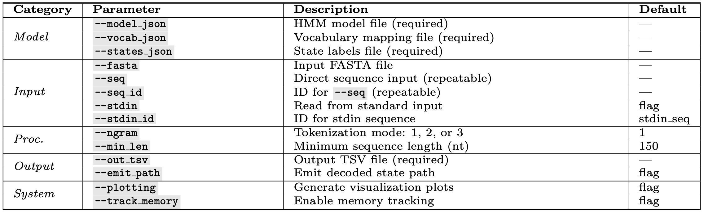

#### Decode from FASTA file

```bash
python scripts/05_decode_path_nt.py \
  --model_json out_dir/04_model/human_marker_testing_3nt_model_em.json \
  --vocab_json out_dir/04_model/human_marker_testing_3nt_vocab_em.json \
  --states_json out_dir/04_model/human_marker_testing_3nt_states_em.json \
  --ngram 3 \
  --fasta ./webui/static/Sample.fa \
  --min_len 10 \
  --out_tsv out_dir/05_res/human_marker_testing_fasta_res.tsv \
  --plotting \
  --track_memory
```

#### Decode from command-line arguments

```bash
python scripts/05_decode_path_nt.py \
  --model_json out_dir/04_model/human_marker_testing_3nt_model_em.json \
  --vocab_json out_dir/04_model/human_marker_testing_3nt_vocab_em.json \
  --states_json out_dir/04_model/human_marker_testing_3nt_states_em.json \
  --ngram 3 \
  --min_len 10 \
  --seq ATACCCATGGCCAACCTCCTACTCCTCATTGTACCCATTCTAATCGCAATGGCATTCCTAATGCTTACCGAACGAAAAATTCTAGGCTATATACAACTACGCAAAGGCCCCAACGTTGTAGGCCCCTACGGGCTACTACAACCCTTCGCTGACGCCATAAAACTCTTCACCAAAGAGCCCCTAAAACCCGCCACATCTACCATCACCCTCTACATCACCGCCCCGACCTTAGCTCTCACCATCGCTCTTCTACTATGAACCCCCCTCCCCATACCCAACCCCCTGGTCAACCTCAACCTAGGCCTCCTATTTATTCTAGCCACCTCTAGCCTAGCCGTTTACTCAATCCTCTGATCAGGGTGAGCATCAAACTCAAACTACGCCCTGATCGGCGCACTGCGAGCAGTAGCCCAAACAATCTCATATGAAGTCA \
  --seq_id marker_test_1 \
  --seq GTCACCCTAGCCATCATTCTACTATCAACATTACTAATAAGTGGCTCCTTTAACCTCTCCACCCTTATCACAACACAAGAACACCTCTGATTACTCCTGCCATCATGACCCTTGGCCATAATATGATTTATCTCCACACTAGCAGAGACCAACCGAACCCCCTTCGACCTTGCCGAAGGGGAGTCCGAACTAGTCTCAGGCTTCAACATCGAATACGCCGCAGGCCCCTTCGCCCTATTCTTCATAGCCGAATACACAAACATTATTATAATAAACACCCTCACCACTACAATCTTCCTAGGAACAACATATGACGCACTCTCCCCTGAACTCTACACAACATATTTTGTCACCAAGACCCTACTTCTAACCTCCCTGTTCTTATGAATTCGAACAGCATACCCCCGATTCCGCTACGACCAACTCATACACCTCCTATGAAAAAACTTCCTACCACTCACCCTAGCATTACTTATATGATATGTCTCCATACCCATTACAATCTCCAGCATTCCCCCTCAAACC \
  --seq_id marker_test_2 \
  --out_tsv out_dir/05_res/human_marker_testing_arg_res.tsv \
  --plotting \
  --track_memory
```

---

## Visualization Examples

The decoding step generates informative plots (with `--plotting` flag):

| Plot | Description |
|:---:|:---|
| 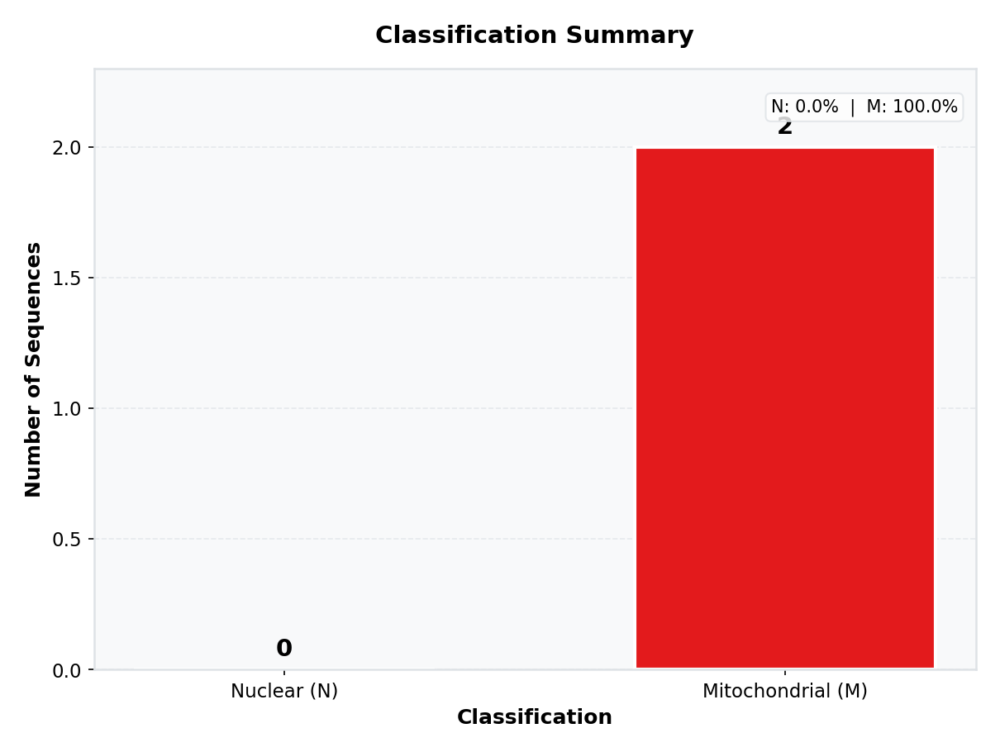 | **Classification Counts**: Proportion of sequences classified as nuclear vs. mitochondrial |
| 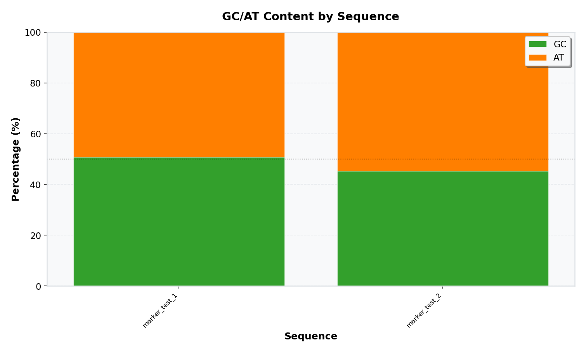 | **GC Content**: GC content proportion across sequences |
| 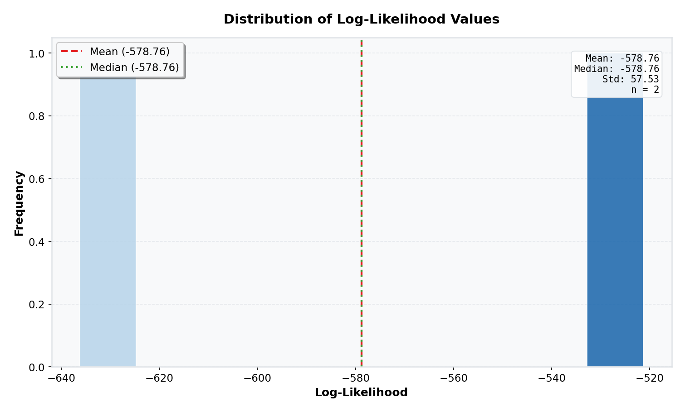 | **Log-Likelihood Distribution**: Model fit scores for decoded sequences |
| 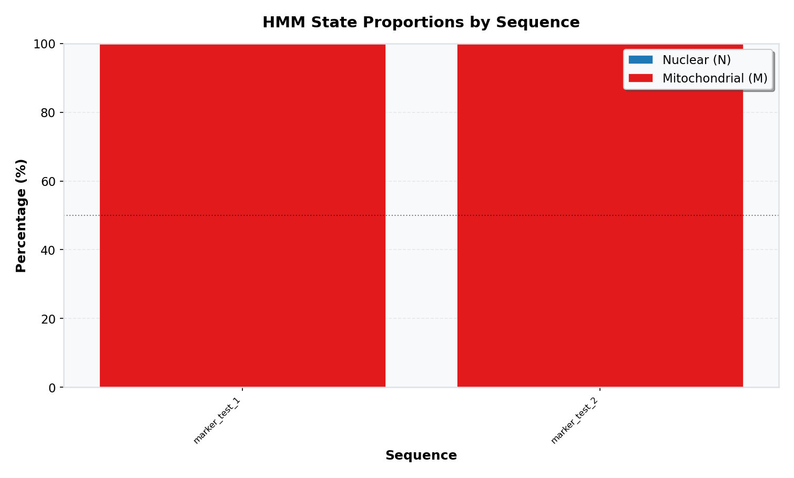 | **Hidden State Proportions**: Time spent in nuclear vs. mitochondrial states |

---

## Using Your Own Data

In our training setup, the input for each gene was its complete transcript sequence (**5′ UTR + CDS + 3′ UTR**), rather than the CDS alone. This design accounts for the fact that UTRs differ substantially between mtGenes and nGenes:

- mtGene 3′ UTRs often lack microRNA-binding sites
- mtGene 3′ UTRs typically lack canonical polyadenylation signals

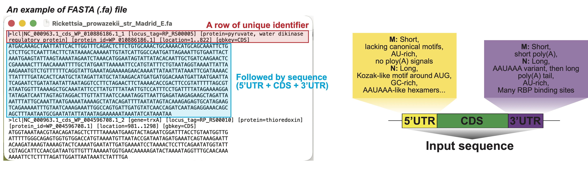

**Recommendation:** For best results with your own data, use **5′ UTR + CDS + 3′ UTR** sequences.

---

## Web Interface

mitoSpotter includes a modern web interface for both training and decoding:

```bash
python -m webui.app
# Open http://localhost:8000
```

Features:
- Interactive sequence input (paste or upload FASTA)
- Real-time training progress with progress bar
- Visualization of results
- Export results as TSV/CSV

---

## Authors

Designed by [Yuchen (Ethan) Shen](https://github.com/EthanShenx) and [Yuxin (Gabriel) Wu](https://github.com/GabrielWuyuxin), inspired by the Biomedical Informatics 3 course at [ZJE](https://zje.zju.edu.cn/zje/main.htm).

---

## License

MIT License - see [LICENSE](LICENSE) for details.
